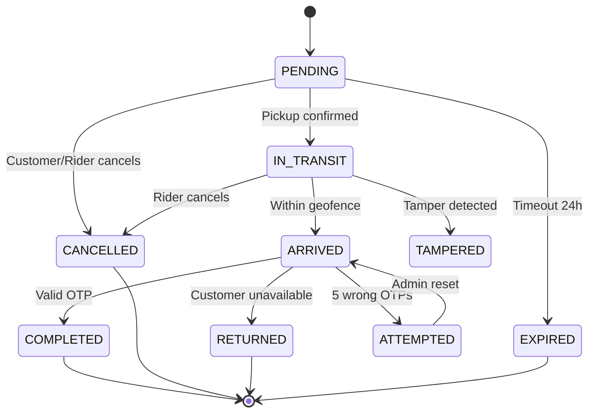
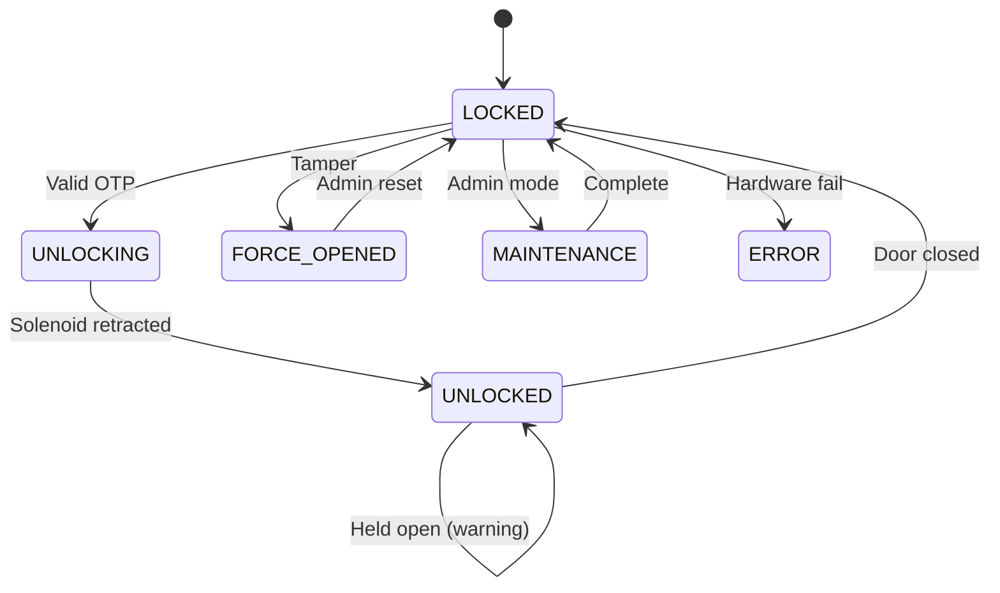
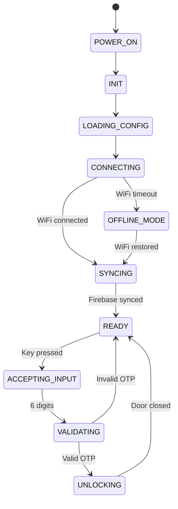
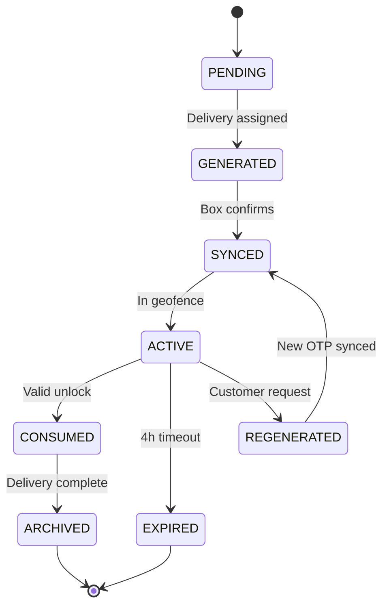
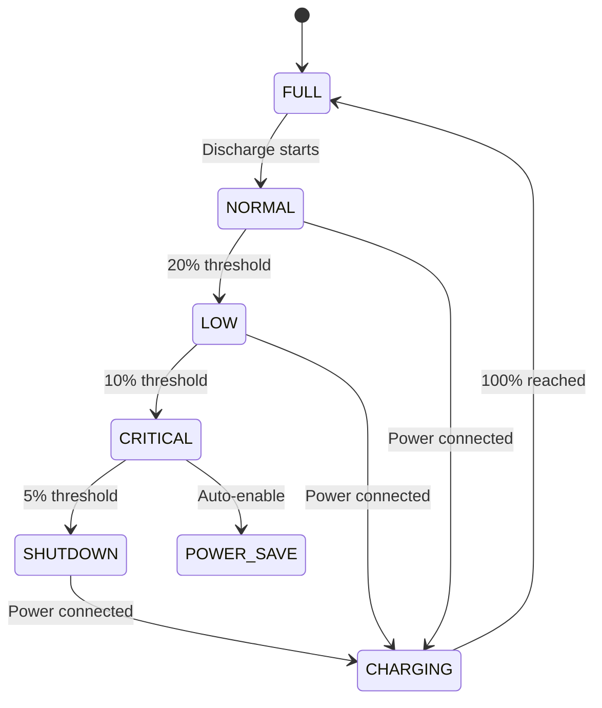
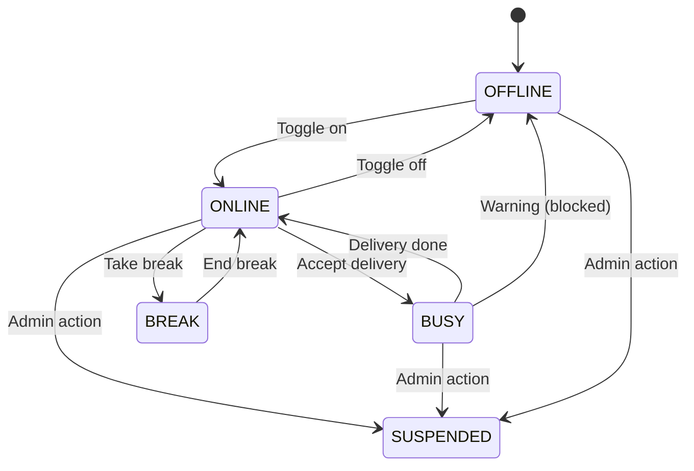
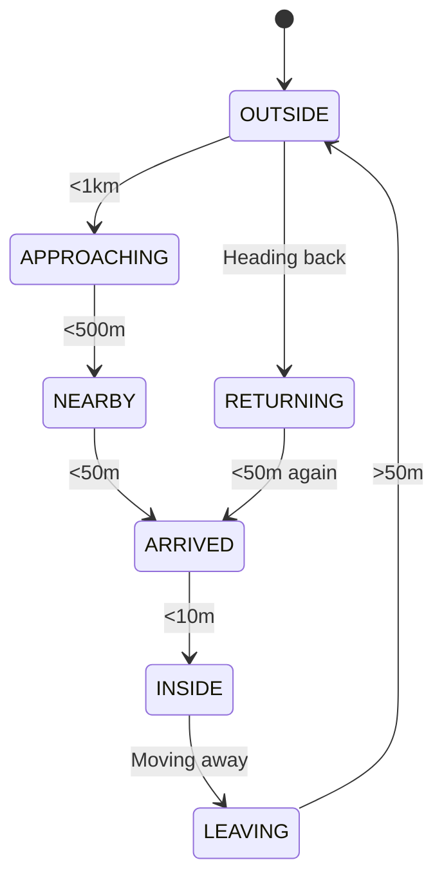
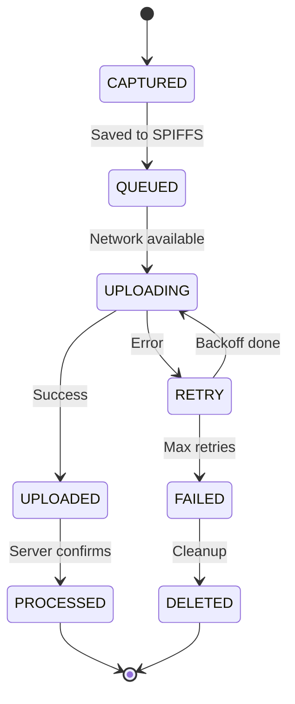

# State Transition Test Cases

Comprehensive list of state transition test cases for the Parcel-Safe Smart Top Box delivery system. These cases validate correct state machine behavior and proper handling of state changes.

---

## 📦 Delivery State Machine (SC-DEL)

### SC-DEL-01: PENDING → IN_TRANSIT
**Trigger:** Rider confirms package pickup
**Precondition:** Delivery assigned to rider, rider at pickup location
**Action:** Status updated, OTP synced to box
**Postcondition:** Status = IN_TRANSIT, timestamp recorded
**Validation:** Customer tracking shows "On the way"

---

### SC-DEL-02: IN_TRANSIT → ARRIVED
**Trigger:** Rider enters 50m geofence
**Precondition:** Status = IN_TRANSIT, GPS valid
**Action:** Status updated, push notification sent
**Postcondition:** Status = ARRIVED, OTP visible to customer
**Validation:** Customer notified, OTP card shown

---

### SC-DEL-03: ARRIVED → COMPLETED
**Trigger:** Box successfully unlocked with valid OTP
**Precondition:** Status = ARRIVED, OTP validated
**Action:** Status updated, photo uploaded, delivery finalized
**Postcondition:** Status = COMPLETED, payment triggered
**Validation:** Audit log complete

---

### SC-DEL-04: PENDING → CANCELLED (By Customer)
**Trigger:** Customer cancels before pickup
**Precondition:** Status = PENDING
**Action:** Status updated, OTP revoked
**Postcondition:** Status = CANCELLED, refund initiated
**Validation:** Rider notified, delivery removed from queue

---

### SC-DEL-05: IN_TRANSIT → CANCELLED (By Rider)
**Trigger:** Rider cancels mid-delivery
**Precondition:** Status = IN_TRANSIT
**Action:** Status updated, box OTP cleared
**Postcondition:** Status = CANCELLED, return flow initiated
**Validation:** Customer notified, refund processed

---

### SC-DEL-06: ARRIVED → RETURNED
**Trigger:** Customer not available, rider times out
**Precondition:** Status = ARRIVED for >30 minutes
**Action:** Status updated, return OTP generated
**Postcondition:** Status = RETURNED, package going back
**Validation:** Sender notified

---

### SC-DEL-07: IN_TRANSIT → TAMPERED
**Trigger:** Tamper sensor triggered
**Precondition:** Status = IN_TRANSIT, door forced open
**Action:** Status updated, photo captured, alerts sent
**Postcondition:** Status = TAMPERED, investigation started
**Validation:** Admin alerted, box in lockdown

---

### SC-DEL-08: PENDING → EXPIRED
**Trigger:** Delivery not picked up within 24 hours
**Precondition:** Status = PENDING for >24h
**Action:** Auto-cancel triggered
**Postcondition:** Status = EXPIRED, OTP revoked
**Validation:** All parties notified

---

### SC-DEL-09: Invalid: PENDING → COMPLETED
**Trigger:** Attempt to complete without pickup
**Precondition:** Status = PENDING
**Expected:** Transition rejected, error logged
**Validation:** State machine enforces order

---

### SC-DEL-10: Invalid: COMPLETED → IN_TRANSIT
**Trigger:** Attempt to revert after completion
**Precondition:** Status = COMPLETED
**Expected:** Transition rejected, immutable state
**Validation:** Historical integrity maintained

---

### SC-DEL-11: Invalid: CANCELLED → ARRIVED
**Trigger:** GPS update after cancellation
**Precondition:** Status = CANCELLED
**Expected:** GPS updates ignored, no state change
**Validation:** Cancelled deliveries are terminal

---

### SC-DEL-12: ARRIVED → ATTEMPTED
**Trigger:** Customer attempts wrong OTP 5x
**Precondition:** Status = ARRIVED, lockout triggered
**Action:** Status updated, admin alerted
**Postcondition:** Status = ATTEMPTED, waiting for support
**Validation:** Lockout logged with timestamp

---

### SC-DEL-13: ATTEMPTED → ARRIVED
**Trigger:** Admin resets lockout
**Precondition:** Status = ATTEMPTED
**Action:** Lockout counter cleared
**Postcondition:** Status = ARRIVED, customer can retry
**Validation:** New attempts allowed

---

### SC-DEL-14: IN_TRANSIT → DELAYED
**Trigger:** ETA exceeded by >30 minutes
**Precondition:** Status = IN_TRANSIT, slow progress
**Action:** Status flag added
**Postcondition:** Status = IN_TRANSIT (DELAYED)
**Validation:** Customer sees delay notification

---

### SC-DEL-15: DELAYED → ARRIVED
**Trigger:** Rider finally reaches destination
**Precondition:** Status = IN_TRANSIT (DELAYED)
**Action:** Delay resolved
**Postcondition:** Status = ARRIVED
**Validation:** Normal completion flow resumes

---

## 🔒 Box Lock State Machine (SC-LOCK)

### SC-LOCK-01: LOCKED → UNLOCKING
**Trigger:** Valid OTP entered
**Precondition:** is_locked = true, OTP valid
**Action:** Photo captured, solenoid activating
**Postcondition:** is_locked = UNLOCKING (transitional)
**Validation:** LED turns blue

---

### SC-LOCK-02: UNLOCKING → UNLOCKED
**Trigger:** Solenoid fully retracted
**Precondition:** Solenoid command sent
**Action:** Lock sensor confirms open
**Postcondition:** is_locked = false
**Validation:** Firebase updated in <100ms

---

### SC-LOCK-03: UNLOCKED → LOCKED
**Trigger:** Door closed, timer elapsed
**Precondition:** is_locked = false, door closed
**Action:** Solenoid re-engages
**Postcondition:** is_locked = true
**Validation:** LED turns green

---

### SC-LOCK-04: LOCKED → FORCE_OPENED (Tamper)
**Trigger:** Door opened without valid OTP
**Precondition:** is_locked = true
**Action:** Tamper photo, alert, lockdown
**Postcondition:** State = FORCE_OPENED
**Validation:** Cannot unlock until reset

---

### SC-LOCK-05: FORCE_OPENED → LOCKED
**Trigger:** Admin remote reset
**Precondition:** State = FORCE_OPENED
**Action:** Lockdown cleared
**Postcondition:** is_locked = true, normal ops
**Validation:** Box returns to service

---

### SC-LOCK-06: UNLOCKED → UNLOCKED (Held Open)
**Trigger:** Door kept open
**Precondition:** is_locked = false
**Action:** Timer warning beeps
**Postcondition:** is_locked = false
**Validation:** After 60s, alert admin

---

### SC-LOCK-07: LOCKED → MAINTENANCE
**Trigger:** Admin initiates maintenance mode
**Precondition:** is_locked = true
**Action:** Special unlock, no delivery
**Postcondition:** State = MAINTENANCE
**Validation:** Cannot accept new deliveries

---

### SC-LOCK-08: MAINTENANCE → LOCKED
**Trigger:** Maintenance complete, door closed
**Precondition:** State = MAINTENANCE
**Action:** Resume normal operation
**Postcondition:** is_locked = true
**Validation:** Ready for new assignments

---

### SC-LOCK-09: Invalid: UNLOCKED → FORCE_OPENED
**Trigger:** Tamper during valid unlock
**Precondition:** is_locked = false (legitimate)
**Expected:** Not tamper, door was already open
**Validation:** No false positive alerts

---

### SC-LOCK-10: LOCKED → ERROR
**Trigger:** Solenoid command fails 3x
**Precondition:** is_locked = true
**Action:** Hardware error flagged
**Postcondition:** State = ERROR
**Validation:** Box marked out of service

---

## 📱 App Session State Machine (SC-APP)

### SC-APP-01: LOGGED_OUT → AUTHENTICATING
**Trigger:** User taps "Sign in with Google"
**Precondition:** No session exists
**Action:** OAuth flow initiated
**Postcondition:** State = AUTHENTICATING
**Validation:** Google popup shown

---

### SC-APP-02: AUTHENTICATING → LOGGED_IN
**Trigger:** OAuth successful
**Precondition:** Valid Google token received
**Action:** Session created, token stored
**Postcondition:** State = LOGGED_IN
**Validation:** Redirect to dashboard

---

### SC-APP-03: AUTHENTICATING → LOGGED_OUT
**Trigger:** OAuth failed/cancelled
**Precondition:** State = AUTHENTICATING
**Action:** Error shown, return to login
**Postcondition:** State = LOGGED_OUT
**Validation:** No partial session created

---

### SC-APP-04: LOGGED_IN → ACTIVE_DELIVERY
**Trigger:** Rider accepts delivery
**Precondition:** State = LOGGED_IN, rider online
**Action:** Delivery assigned
**Postcondition:** State = ACTIVE_DELIVERY
**Validation:** Tracking features enabled

---

### SC-APP-05: ACTIVE_DELIVERY → LOGGED_IN
**Trigger:** Delivery completed/cancelled
**Precondition:** State = ACTIVE_DELIVERY
**Action:** Delivery finalized
**Postcondition:** State = LOGGED_IN
**Validation:** Ready for new delivery

---

### SC-APP-06: LOGGED_IN → LOGGED_OUT
**Trigger:** User taps logout
**Precondition:** State = LOGGED_IN
**Action:** Session cleared, cache purged
**Postcondition:** State = LOGGED_OUT
**Validation:** Navigate to login screen

---

### SC-APP-07: LOGGED_IN → SESSION_EXPIRED
**Trigger:** Token expires (30 days)
**Precondition:** State = LOGGED_IN, token old
**Action:** Automatic detection
**Postcondition:** State = SESSION_EXPIRED
**Validation:** Prompt to re-login

---

### SC-APP-08: SESSION_EXPIRED → AUTHENTICATING
**Trigger:** User agrees to re-login
**Precondition:** State = SESSION_EXPIRED
**Action:** OAuth flow restarted
**Postcondition:** State = AUTHENTICATING
**Validation:** Preserve deep link target

---

### SC-APP-09: LOGGED_IN → OFFLINE
**Trigger:** Network connection lost
**Precondition:** State = LOGGED_IN
**Action:** Offline mode enabled
**Postcondition:** State = OFFLINE
**Validation:** Banner shown, cached data used

---

### SC-APP-10: OFFLINE → LOGGED_IN
**Trigger:** Network restored
**Precondition:** State = OFFLINE
**Action:** Sync queued updates
**Postcondition:** State = LOGGED_IN
**Validation:** All pending data synced

---

## 🌐 Web Tracking State Machine (SC-WEB)

### SC-WEB-01: LOADING → CONNECTED
**Trigger:** Firebase subscription successful
**Precondition:** Valid token, Firebase reachable
**Action:** Realtime listener attached
**Postcondition:** State = CONNECTED
**Validation:** Map shows live location

---

### SC-WEB-02: LOADING → ERROR
**Trigger:** Invalid token
**Precondition:** Token doesnt exist in DB
**Action:** 404 page rendered
**Postcondition:** State = ERROR
**Validation:** "Delivery not found" shown

---

### SC-WEB-03: CONNECTED → WAITING
**Trigger:** Delivery pending (no rider yet)
**Precondition:** State = CONNECTED, status = PENDING
**Action:** Waiting UI shown
**Postcondition:** State = WAITING
**Validation:** "Looking for rider" message

---

### SC-WEB-04: WAITING → TRACKING
**Trigger:** Rider assigned, location received
**Precondition:** State = WAITING
**Action:** Map initialized with marker
**Postcondition:** State = TRACKING
**Validation:** Real-time updates flowing

---

### SC-WEB-05: TRACKING → ARRIVING
**Trigger:** Distance < 500m
**Precondition:** State = TRACKING
**Action:** ETA countdown shown
**Postcondition:** State = ARRIVING
**Validation:** "Almost there" notification

---

### SC-WEB-06: ARRIVING → ARRIVED
**Trigger:** Distance < 50m
**Precondition:** State = ARRIVING
**Action:** OTP revealed
**Postcondition:** State = ARRIVED
**Validation:** Green "Rider here" banner

---

### SC-WEB-07: ARRIVED → COMPLETED
**Trigger:** Status = COMPLETED in Firebase
**Precondition:** State = ARRIVED
**Action:** Proof photo displayed
**Postcondition:** State = COMPLETED
**Validation:** Success message, rating prompt

---

### SC-WEB-08: CONNECTED → STALE
**Trigger:** No GPS update for 60s
**Precondition:** State = CONNECTED/TRACKING
**Action:** "Last seen X ago" shown
**Postcondition:** State = STALE
**Validation:** User aware data is old

---

### SC-WEB-09: STALE → TRACKING
**Trigger:** GPS update received
**Precondition:** State = STALE
**Action:** Marker position updated
**Postcondition:** State = TRACKING
**Validation:** Normal tracking resumes

---

### SC-WEB-10: TRACKING → TAMPER_ALERT
**Trigger:** tamper_status = true in Firebase
**Precondition:** State = TRACKING
**Action:** Warning banner overlay
**Postcondition:** State = TAMPER_ALERT
**Validation:** Security warning displayed

---

## 🔧 Hardware Boot State Machine (SC-BOOT)

### SC-BOOT-01: POWER_ON → INIT
**Trigger:** Power supply connected
**Precondition:** None
**Action:** CPU starts, RAM initialized
**Postcondition:** State = INIT
**Validation:** LED blinks

---

### SC-BOOT-02: INIT → LOADING_CONFIG
**Trigger:** Firmware runs setup()
**Precondition:** State = INIT
**Action:** Read SPIFFS config file
**Postcondition:** State = LOADING_CONFIG
**Validation:** WiFi credentials loaded

---

### SC-BOOT-03: LOADING_CONFIG → CONNECTING
**Trigger:** Config loaded successfully
**Precondition:** State = LOADING_CONFIG
**Action:** WiFi.begin() called
**Postcondition:** State = CONNECTING
**Validation:** LED blinks blue

---

### SC-BOOT-04: CONNECTING → SYNCING
**Trigger:** WiFi connected
**Precondition:** State = CONNECTING, WiFi available
**Action:** Firebase connection established
**Postcondition:** State = SYNCING
**Validation:** IP address assigned

---

### SC-BOOT-05: SYNCING → READY
**Trigger:** Firebase data received
**Precondition:** State = SYNCING
**Action:** OTP cached, delivery context loaded
**Postcondition:** State = READY
**Validation:** LED solid green

---

### SC-BOOT-06: CONNECTING → OFFLINE_MODE
**Trigger:** WiFi connect timeout (30s)
**Precondition:** State = CONNECTING
**Action:** Enable offline operation
**Postcondition:** State = OFFLINE_MODE
**Validation:** LED blinks red, local OTP used

---

### SC-BOOT-07: OFFLINE_MODE → SYNCING
**Trigger:** WiFi becomes available
**Precondition:** State = OFFLINE_MODE
**Action:** Reconnection detected
**Postcondition:** State = SYNCING
**Validation:** Queued data uploaded

---

### SC-BOOT-08: READY → ACCEPTING_INPUT
**Trigger:** Keypad button pressed
**Precondition:** State = READY, active delivery
**Action:** Capture keypad input
**Postcondition:** State = ACCEPTING_INPUT
**Validation:** Digits displayed or LED indication

---

### SC-BOOT-09: ACCEPTING_INPUT → VALIDATING
**Trigger:** 6 digits entered or # pressed
**Precondition:** State = ACCEPTING_INPUT
**Action:** Hash OTP, compare
**Postcondition:** State = VALIDATING
**Validation:** Slight delay for security

---

### SC-BOOT-10: VALIDATING → UNLOCKING
**Trigger:** OTP valid
**Precondition:** State = VALIDATING
**Action:** Capture photo, activate solenoid
**Postcondition:** State = UNLOCKING
**Validation:** Photo in buffer

---

### SC-BOOT-11: VALIDATING → LOCKED (Invalid)
**Trigger:** OTP invalid
**Precondition:** State = VALIDATING
**Action:** Increment counter, flash LED
**Postcondition:** State = LOCKED
**Validation:** "Wrong OTP" indication

---

### SC-BOOT-12: UNLOCKING → READY
**Trigger:** Door closed after unlock
**Precondition:** State = UNLOCKING
**Action:** Lock re-engages
**Postcondition:** State = READY
**Validation:** Ready for next delivery

---

## 🔔 Notification State Machine (SC-NOTIF)

### SC-NOTIF-01: QUEUED → SENDING
**Trigger:** Worker picks up notification
**Precondition:** Notification in queue
**Action:** FCM API called
**Postcondition:** State = SENDING
**Validation:** Request logged

---

### SC-NOTIF-02: SENDING → DELIVERED
**Trigger:** FCM returns success
**Precondition:** State = SENDING
**Action:** Mark as delivered
**Postcondition:** State = DELIVERED
**Validation:** Message ID recorded

---

### SC-NOTIF-03: SENDING → FAILED
**Trigger:** FCM returns error
**Precondition:** State = SENDING
**Action:** Log error, schedule retry
**Postcondition:** State = FAILED
**Validation:** Retry counter incremented

---

### SC-NOTIF-04: FAILED → SENDING (Retry)
**Trigger:** Retry timer fires
**Precondition:** State = FAILED, retries < 3
**Action:** FCM API called again
**Postcondition:** State = SENDING
**Validation:** Exponential backoff applied

---

### SC-NOTIF-05: FAILED → ABANDONED
**Trigger:** Retry count = 3
**Precondition:** State = FAILED
**Action:** Mark as abandoned
**Postcondition:** State = ABANDONED
**Validation:** Fallback to SMS considered

---

### SC-NOTIF-06: QUEUED → CANCELLED
**Trigger:** Associated event cancelled
**Precondition:** State = QUEUED
**Action:** Remove from queue
**Postcondition:** State = CANCELLED
**Validation:** No notification sent

---

### SC-NOTIF-07: DELIVERED → READ
**Trigger:** App reports notification opened
**Precondition:** State = DELIVERED
**Action:** Read receipt logged
**Postcondition:** State = READ
**Validation:** Engagement tracked

---

### SC-NOTIF-08: DELIVERED → DISMISSED
**Trigger:** User swipes away notification
**Precondition:** State = DELIVERED
**Action:** Dismissal logged
**Postcondition:** State = DISMISSED
**Validation:** Analytics recorded

---

## 🔑 OTP State Machine (SC-OTP)

### SC-OTP-01: PENDING → GENERATED
**Trigger:** New delivery assigned to rider
**Precondition:** Delivery created, no OTP exists
**Action:** Server generates 6-digit OTP and hash
**Postcondition:** OTP state = GENERATED
**Validation:** OTP stored in database

---

### SC-OTP-02: GENERATED → SYNCED
**Trigger:** Box acknowledges OTP receipt
**Precondition:** State = GENERATED, box online
**Action:** Box caches OTP hash locally
**Postcondition:** OTP state = SYNCED
**Validation:** Firebase confirms sync

---

### SC-OTP-03: SYNCED → ACTIVE
**Trigger:** Rider enters delivery geofence
**Precondition:** State = SYNCED, rider within 50m
**Action:** OTP becomes visible to customer
**Postcondition:** OTP state = ACTIVE
**Validation:** Customer tracking shows OTP

---

### SC-OTP-04: ACTIVE → CONSUMED
**Trigger:** Valid OTP successfully unlocks box
**Precondition:** State = ACTIVE, correct OTP entered
**Action:** OTP marked as used, cannot reuse
**Postcondition:** OTP state = CONSUMED
**Validation:** Unlock logged with timestamp

---

### SC-OTP-05: ACTIVE → EXPIRED
**Trigger:** 4-hour validity period elapsed
**Precondition:** State = ACTIVE, time > 4 hours since generation
**Action:** OTP invalidated on box
**Postcondition:** OTP state = EXPIRED
**Validation:** Box rejects old OTP

---

### SC-OTP-06: ACTIVE → REGENERATED
**Trigger:** Customer requests new OTP
**Precondition:** State = ACTIVE, OTP compromised
**Action:** Old OTP revoked, new OTP generated
**Postcondition:** OTP state = REGENERATED
**Validation:** Old OTP fails validation

---

### SC-OTP-07: REGENERATED → SYNCED
**Trigger:** New OTP synced to box
**Precondition:** State = REGENERATED
**Action:** Box receives and caches new OTP
**Postcondition:** OTP state = SYNCED
**Validation:** Both web and box show new OTP

---

### SC-OTP-08: CONSUMED → ARCHIVED
**Trigger:** Delivery completed
**Precondition:** State = CONSUMED
**Action:** OTP moved to audit archive
**Postcondition:** OTP state = ARCHIVED
**Validation:** Available in audit logs only

---

## 🔋 Battery State Machine (SC-BATT)

### SC-BATT-01: FULL → NORMAL
**Trigger:** Battery drops below 100%
**Precondition:** Battery = 100%
**Action:** Start normal discharge tracking
**Postcondition:** Battery state = NORMAL (100-21%)
**Validation:** No alerts triggered

---

### SC-BATT-02: NORMAL → LOW
**Trigger:** Battery reaches 20%
**Precondition:** Battery state = NORMAL
**Action:** Low battery warning sent
**Postcondition:** Battery state = LOW (20-11%)
**Validation:** Push notification to rider

---

### SC-BATT-03: LOW → CRITICAL
**Trigger:** Battery reaches 10%
**Precondition:** Battery state = LOW
**Action:** Critical alert, power-saving mode
**Postcondition:** Battery state = CRITICAL (10-6%)
**Validation:** Admin alerted, GPS frequency reduced

---

### SC-BATT-04: CRITICAL → SHUTDOWN
**Trigger:** Battery reaches 5%
**Precondition:** Battery state = CRITICAL
**Action:** Safe shutdown sequence initiated
**Postcondition:** Battery state = SHUTDOWN
**Validation:** State saved before power off

---

### SC-BATT-05: SHUTDOWN → CHARGING
**Trigger:** External power connected
**Precondition:** Battery state = SHUTDOWN or any depleted state
**Action:** Charging detected, boot sequence
**Postcondition:** Battery state = CHARGING
**Validation:** Charging indicator active

---

### SC-BATT-06: CHARGING → FULL
**Trigger:** Battery reaches 100%
**Precondition:** Battery state = CHARGING
**Action:** Charging complete notification
**Postcondition:** Battery state = FULL
**Validation:** LED shows full charge

---

### SC-BATT-07: CRITICAL → POWER_SAVE
**Trigger:** Auto-enable when critical
**Precondition:** Battery state = CRITICAL
**Action:** Reduce GPS updates, dim LED, disable preview
**Postcondition:** Power-save mode active
**Validation:** Core unlock still functional

---

## 📷 Photo Upload State Machine (SC-PHOTO)

### SC-PHOTO-01: CAPTURED → QUEUED
**Trigger:** Photo taken successfully
**Precondition:** Camera capture complete
**Action:** Photo saved to SPIFFS queue
**Postcondition:** Photo state = QUEUED
**Validation:** File exists on filesystem

---

### SC-PHOTO-02: QUEUED → UPLOADING
**Trigger:** Network available, queue processor runs
**Precondition:** Photo state = QUEUED, WiFi connected
**Action:** Upload to Firebase Storage initiated
**Postcondition:** Photo state = UPLOADING
**Validation:** Upload progress tracked

---

### SC-PHOTO-03: UPLOADING → UPLOADED
**Trigger:** Firebase confirms upload success
**Precondition:** Photo state = UPLOADING
**Action:** Photo URL saved, local file marked for cleanup
**Postcondition:** Photo state = UPLOADED
**Validation:** URL accessible

---

### SC-PHOTO-04: UPLOADING → RETRY
**Trigger:** Upload fails (timeout, network error)
**Precondition:** Photo state = UPLOADING, error occurred
**Action:** Increment retry counter, schedule retry
**Postcondition:** Photo state = RETRY
**Validation:** Exponential backoff applied

---

### SC-PHOTO-05: RETRY → UPLOADING
**Trigger:** Retry timer fires
**Precondition:** Photo state = RETRY, retries < max
**Action:** Upload attempt restarted
**Postcondition:** Photo state = UPLOADING
**Validation:** New attempt logged

---

### SC-PHOTO-06: RETRY → FAILED
**Trigger:** Max retry attempts reached
**Precondition:** Photo state = RETRY, retries = max
**Action:** Mark as failed, alert admin
**Postcondition:** Photo state = FAILED
**Validation:** Photo logged for manual handling

---

### SC-PHOTO-07: FAILED → DELETED
**Trigger:** Storage cleanup or manual intervention
**Precondition:** Photo state = FAILED
**Action:** Photo file removed from SPIFFS
**Postcondition:** Photo state = DELETED
**Validation:** Storage space freed

---

### SC-PHOTO-08: UPLOADED → PROCESSED
**Trigger:** Server confirms receipt and processing
**Precondition:** Photo state = UPLOADED
**Action:** Link to delivery record
**Postcondition:** Photo state = PROCESSED
**Validation:** Visible in delivery details

---

## 🛵 Rider Availability State Machine (SC-RIDER)

### SC-RIDER-01: OFFLINE → ONLINE
**Trigger:** Rider toggles availability on
**Precondition:** Rider logged in, not suspended
**Action:** Status broadcast, eligible for assignments
**Postcondition:** Rider state = ONLINE
**Validation:** Appears in available riders list

---

### SC-RIDER-02: ONLINE → BUSY
**Trigger:** Rider accepts delivery
**Precondition:** Rider state = ONLINE
**Action:** Assignment confirmed, no new offers
**Postcondition:** Rider state = BUSY
**Validation:** Cannot accept new deliveries

---

### SC-RIDER-03: BUSY → ONLINE
**Trigger:** Delivery completed or cancelled
**Precondition:** Rider state = BUSY
**Action:** Ready for new assignments
**Postcondition:** Rider state = ONLINE
**Validation:** Back in available pool

---

### SC-RIDER-04: ONLINE → BREAK
**Trigger:** Rider requests break
**Precondition:** Rider state = ONLINE
**Action:** Temporarily unavailable for assignments
**Postcondition:** Rider state = BREAK
**Validation:** Not offered new deliveries

---

### SC-RIDER-05: BREAK → ONLINE
**Trigger:** Rider ends break
**Precondition:** Rider state = BREAK
**Action:** Resume availability
**Postcondition:** Rider state = ONLINE
**Validation:** Back in assignment pool

---

### SC-RIDER-06: ONLINE → OFFLINE
**Trigger:** Rider toggles off or logs out
**Precondition:** Rider state = ONLINE
**Action:** Availability withdrawn
**Postcondition:** Rider state = OFFLINE
**Validation:** Removed from available riders

---

### SC-RIDER-07: BUSY → OFFLINE (Warning)
**Trigger:** Rider attempts offline with active delivery
**Precondition:** Rider state = BUSY
**Action:** Warning shown, must complete/cancel first
**Postcondition:** State unchanged until delivery resolved
**Validation:** Cannot force offline with package

---

### SC-RIDER-08: Any → SUSPENDED
**Trigger:** Admin suspends rider account
**Precondition:** Any rider state
**Action:** Immediate lockout, deliveries reassigned
**Postcondition:** Rider state = SUSPENDED
**Validation:** Cannot login until reinstated

---

## 📍 Geofence State Machine (SC-GEO)

### SC-GEO-01: OUTSIDE → APPROACHING
**Trigger:** Rider enters 1km radius
**Precondition:** Distance > 1km, now < 1km
**Action:** Customer notified "Rider is nearby"
**Postcondition:** Geofence state = APPROACHING
**Validation:** ETA countdown shown

---

### SC-GEO-02: APPROACHING → NEARBY
**Trigger:** Rider enters 500m radius
**Precondition:** Distance > 500m, now < 500m
**Action:** "Almost there" notification
**Postcondition:** Geofence state = NEARBY
**Validation:** Map zooms to delivery area

---

### SC-GEO-03: NEARBY → ARRIVED
**Trigger:** Rider enters 50m radius
**Precondition:** Distance > 50m, now < 50m
**Action:** OTP revealed, arrival notification
**Postcondition:** Geofence state = ARRIVED
**Validation:** Customer sees OTP code

---

### SC-GEO-04: ARRIVED → INSIDE
**Trigger:** Rider within 10m of exact location
**Precondition:** Distance > 10m, now < 10m
**Action:** Precise arrival confirmed
**Postcondition:** Geofence state = INSIDE
**Validation:** "Rider is here" message

---

### SC-GEO-05: INSIDE → LEAVING
**Trigger:** Rider moves away from location
**Precondition:** Distance < 10m, now increasing
**Action:** Movement detected
**Postcondition:** Geofence state = LEAVING
**Validation:** Track if delivery completed

---

### SC-GEO-06: LEAVING → OUTSIDE
**Trigger:** Rider exits 50m radius
**Precondition:** Geofence state = LEAVING
**Action:** Check delivery status
**Postcondition:** Geofence state = OUTSIDE
**Validation:** Alert if not completed

---

### SC-GEO-07: OUTSIDE → RETURNING
**Trigger:** Rider moves back toward location
**Precondition:** State = OUTSIDE, distance decreasing
**Action:** Update customer "Rider returning"
**Postcondition:** Geofence state = RETURNING
**Validation:** Track inbound movement

---

## 🔧 Admin Action State Machine (SC-ADMIN)

### SC-ADMIN-01: NORMAL → REVIEWING
**Trigger:** Customer files dispute
**Precondition:** Delivery in NORMAL state
**Action:** Ticket created, admin notified
**Postcondition:** Admin state = REVIEWING
**Validation:** Dispute visible in admin panel

---

### SC-ADMIN-02: REVIEWING → RESOLVED
**Trigger:** Admin makes decision
**Precondition:** Admin state = REVIEWING
**Action:** Resolution recorded
**Postcondition:** Admin state = RESOLVED
**Validation:** Customer notified of outcome

---

### SC-ADMIN-03: REVIEWING → ESCALATED
**Trigger:** Complex case needs senior review
**Precondition:** Admin state = REVIEWING
**Action:** Transferred to senior admin
**Postcondition:** Admin state = ESCALATED
**Validation:** Senior admin queue updated

---

### SC-ADMIN-04: ESCALATED → RESOLVED
**Trigger:** Senior admin makes final decision
**Precondition:** Admin state = ESCALATED
**Action:** Final resolution recorded
**Postcondition:** Admin state = RESOLVED
**Validation:** Case closed, metrics updated

---

### SC-ADMIN-05: RESOLVED → REFUNDED
**Trigger:** Resolution includes refund
**Precondition:** Admin state = RESOLVED
**Action:** Payment reversal initiated
**Postcondition:** Admin state = REFUNDED
**Validation:** Customer receives refund

---

### SC-ADMIN-06: RESOLVED → CLOSED
**Trigger:** No further action required
**Precondition:** Admin state = RESOLVED
**Action:** Archive case
**Postcondition:** Admin state = CLOSED
**Validation:** Case moved to history

---

## Summary

| Category | Count |
|----------|-------|
| 📦 Delivery State Machine | 15 |
| 🔒 Box Lock State Machine | 10 |
| 📱 App Session State Machine | 10 |
| 🌐 Web Tracking State Machine | 10 |
| 🔧 Hardware Boot State Machine | 12 |
| 🔔 Notification State Machine | 8 |
| 🔑 OTP State Machine | 8 |
| 🔋 Battery State Machine | 7 |
| 📷 Photo Upload State Machine | 8 |
| 🛵 Rider Availability State Machine | 8 |
| 📍 Geofence State Machine | 7 |
| 🔧 Admin Action State Machine | 6 |
| **Total** | **109** |

---

## State Diagrams

### Delivery State Flow

### Box Lock State Flow

### Hardware Boot State Flow

### OTP State Flow

### Battery State Flow

### Rider Availability State Flow

### Geofence State Flow

### Photo Upload State Flow

---

## Testing Strategy

1. **Unit Tests**: State machine logic with mocked dependencies
2. **Integration Tests**: End-to-end state transitions with real services
3. **Invalid Transitions**: Verify rejection of impossible state changes
4. **Concurrency Tests**: Multiple simultaneous state change attempts
5. **Recovery Tests**: State restoration after reboot/crash
6. **OTP Lifecycle Tests**: Full OTP flow from generation to archive
7. **Battery Simulation**: Discharge/charge cycles with threshold triggers
8. **Photo Queue Tests**: Upload failures, retries, and cleanup
9. **Rider State Tests**: Availability toggles and assignment impacts
10. **Geofence Tests**: GPS-triggered state transitions with accuracy variations