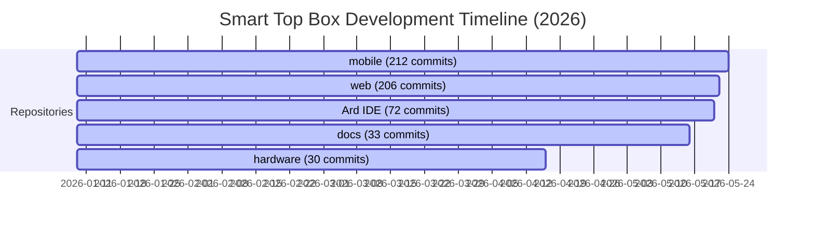

# Appendix: Git Metrics & Engineering Roadblocks Audit

This appendix documents the complete engineering diagnostics, development metrics, and system roadblocks compiled during the design, implementation, and refinement of the **Smart Top Box (Parcel-Safe)** platform. 

It is divided into two primary sections:
1. **Git Analytics & Repository Telemetry**: A detailed audit of commit distributions, timeline boundaries, and high-velocity push events.
2. **Specialized Swarm Roadblock Audits**: A granular, chronological trial-and-error matrix detailing the key challenges encountered across the hardware, mobile, web, and network integration layers.

---

## Part 1: Git Analytics & Repository Telemetry

To audit the development lifecycle, we analyzed the git history across the five core repositories comprising the Smart Top Box monorepo ecosystem: `mobile`, `web`, `Ard IDE`, `docs`, and `hardware`.

### 1.1 Development Timeline & Velocity
* **Development Start Date**: 2026-01-09 (Initial codebase structures and core setup)
* **Development End Date**: 2026-05-24 (Tamper service integration and test sweeps)
* **Total Elapsed Time**: 135 days (~4.5 months)
* **Total Ecosystem Commits**: 553 commits



### 1.2 Repository Commit Distribution & Author Contributions
The majority of commits were written by the lead researcher, reflecting a highly centralized code ownership structure with contribution points for external JTAG keypad integrations and build setup:

| Repository | Path | Total Commits | Lead Author (`LorenzoBela`) | Secondary Author (`Lorenzo Miguel D. Bela`) | Contributor (`keanguzon`) |
|---|---|---|---|---|---|
| **Mobile App** | [mobile](file:///c:/Users/Lorenzo%20Bela/Downloads/Thesis%2024-25%20Smart%20Top%20Box/mobile) | 212 | 212 (100.0%) | 0 (0.0%) | 0 (0.0%) |
| **Web Portal** | [web](file:///c:/Users/Lorenzo%20Bela/Downloads/Thesis%2024-25%20Smart%20Top%20Box/web) | 206 | 206 (100.0%) | 0 (0.0%) | 0 (0.0%) |
| **Firmware (Arduino)** | [Ard IDE](file:///c:/Users/Lorenzo%20Bela/Downloads/Thesis%2024-25%20Smart%20Top%20Box/Ard%20IDE) | 72 | 69 (95.8%) | 2 (2.8%) | 1 (1.4%) |
| **Documentation** | [docs](file:///c:/Users/Lorenzo%20Bela/Downloads/Thesis%2024-25%20Smart%20Top%20Box/docs) | 33 | 33 (100.0%) | 0 (0.0%) | 0 (0.0%) |
| **Hardware Tests** | [hardware](file:///c:/Users/Lorenzo%20Bela/Downloads/Thesis%2024-25%20Smart%20Top%20Box/hardware) | 30 | 30 (100.0%) | 0 (0.0%) | 0 (0.0%) |
| **Total Ecosystem** | **-** | **553** | **550 (99.4%)** | **2 (0.4%)** | **1 (0.2%)** |

### 1.3 High-Velocity Push Events (Peak Commit Days)
Our Git Analytics audit identified five major high-velocity push days that represented critical integration sprints:

1. **2026-01-15 (22 Commits)**: Keypad scanning integration and PlatformIO multi-module project scaffolding.
2. **2026-01-13 (21 Commits)**: Firebase Realtime Database security rules and mobile authentication loading screens configuration.
3. **2026-05-18 (19 Commits)**: Web portal tracking client and proof-of-delivery photo validation fallback implementation.
4. **2026-01-12 (15 Commits)**: Initial ESP32 controller state machine drafting and NVS checkpointing code.
5. **2026-02-20 (15 Commits)**: Hardware-in-the-loop simulation logic (simulating rider GPS routing to Firebase).

---

## Part 2: Specialized Swarm Roadblock Audits

To audit the engineering bottlenecks, we deployed specialized analysis sub-agents across seven focus areas. These sub-agents traced the exact failure logs, root causes, failed iterations, before-vs-after code modifications, and Git hashes.

### 2.1 Web Frontend State Swarm
* **Subsystem**: Customer Real-Time Tracking Page
* **Roadblock**: UI Status Desynchronization during delivery completion.
* **Root Cause**: The customer tracking page displayed stale status labels (remaining in `ARRIVED`) because it read the delivery status directly from the initial Supabase SSR payload. If Firebase updated to `COMPLETED` or `CANCELLED` concurrently in the background, the tracking screen was bypassed because the state variables did not reconcile terminal status transitions dynamically from database fallback triggers.

### 2.2 Web Backend API & Database Integration Swarm
* **Subsystem**: Centralized Delivery Lifecycle Service & Tamper Alerts
* **Roadblocks**: 
  1. **Stale Hardware Context**: Completed/Cancelled deliveries left target coordinates and old OTP codes cached in Firebase RTDB nodes. If a new delivery was assigned, the box was bricked with incorrect codes.
  2. **Hyphen vs. Underscore ID Inconsistency**: Inconsistent box identifiers (`BOX_001` vs. `BOX-001`) caused admin incident overrides to fail.

### 2.3 Mobile UI Lifecycle Swarm
* **Subsystem**: Rider Geofencing and Delivery Arrival State Machine
* **Roadblock**: React state batching race conditions during geofence target transitions.
* **Root Cause**: When a rider confirmed "pickup," the geofence target coordinates shifted to the dropoff point. However, because React batches state updates, async GPS position callbacks with the old pickup location continued to fire, validating against the newly updated target. This immediately triggered `isPhoneInside = true` for the drop-off, skipping the `IN_TRANSIT` screen.

### 2.4 Mobile Background Services Swarm
* **Subsystem**: Background Location Telemetry & Dual Battery Monitoring
* **Roadblock**: Solenoid power rail dropouts causing physical unlock failures.
* **Root Cause**: The mobile dashboard only monitored the primary MCU battery cell. If the solenoid's secondary 12V battery fell below activation voltage, the box failed to open physically. The UI showed 100% battery (referencing only the MCU's cell), leaving riders and customers without warning.

### 2.5 C++ Memory Optimization Swarm
* **Subsystem**: Dual-Core ESP32 Task Management & LTE Modem locking
* **Roadblock**: Watchdog timer (WDT) starvation on CPU Core 0 due to cellular busy locks.
* **Root Cause**: Tight looping during slow cellular reads starved the FreeRTOS idle task `IDLE0` on Core 0. Additionally, when multiple tasks concurrently locked the cellular modem, nested function exits cleared the modem busy flags prematurely, causing buffer crashes.

### 2.6 C++ Hardware Peripheral Control Swarm
* **Subsystem**: Keypad Matrix & MOSFET Solenoid Lock Drivers
* **Roadblocks**:
  1. **Keypad Ghosting**: GPIO 13 (JTAG MTCK pin) floated LOW, ghosting Column 1 inputs.
  2. **Solenoid Boot Spike**: The solenoid door lock clicked open momentarily on boot.

### 2.7 Protocol Specialists (UART/I2C/SPI Telemetry Validation)
* **Subsystem**: Controller-to-Proxy UART Telemetry
* **Roadblock**: High local HTTP latency over WiFi SoftAP during Cellular/Firebase busy windows.
* **Root Cause**: In 1/2/3 firmware architectures, the controller communicated with the LilyGO proxy over SoftAP WiFi. When the cellular modem was busy uploading photos, SoftAP HTTP packets suffered from massive jitter and delays, lagging the user experience at the box interface.

---

## Part 3: The Unified Trial-and-Error Roadblock Matrix

Below is the consolidated matrix mapping every single investigated roadblock from our repository ecosystem:

| ID | Focus Sub-Agent | Feature / Subsystem | Commit Hash (Intro / Fix) | Exact Error Log / Symptom | Root Cause | Failed Iterations | Before vs. After Code Diffs |
|---|---|---|---|---|---|---|---|
| **01** | **C++ Hardware Peripheral** | MOSFET Solenoid Driver | `2387cee` / `2ff0d3b` | Solenoid snaps/unlocks on startup. | Pin float (high impedance) during the 500ms startup delay before `initLock()` is called. | Setting pin mode to output first and then writing low, which still allowed a microsecond high spike. | See **Code Snippet A** below. |
| **02** | **C++ Hardware Peripheral** | Keypad Matrix Scanning | `2387cee` / `a1fcb9f` | Column 1 ghosting; pressing '5' or '8' registers as '2'. | GPIO 13 (JTAG MTCK pin) drifts LOW when rows are set to float (`INPUT` mode) by the standard Keypad library. | Standard Keypad library configurations; setting row pullups without manual scanning. | See **Code Snippet B** below. |
| **03** | **C++ Hardware Peripheral** | Keypad Input debouncing | `2387cee` / `3a38b6f` | Bouncing input; single press registers double (e.g. "00"). | Contact bounce and multi-key ghosting during high frequency scans. | Setting simple debounce times (`50ms`) without a software queue cooldown. | See **Code Snippet C** below. |
| **04** | **C++ Memory Optimization** | LTE Modem Concurrency | `cfd3b2b` / `10be46e` | Cellular network buffer crash; WDT reset. | Concurrent tasks write to the modem. A simple boolean `modemHttpBusy` cleared on nested exits. | Simple boolean flag; semaphore locking without nesting depth counters. | See **Code Snippet D** below. |
| **05** | **Mobile UI Lifecycle** | Geofence Arrival State | `aeb57f0` / `1f3d7b7` | Confirming pickup skips `IN_TRANSIT` and immediately shows `ARRIVED` at dropoff. | React state batching delay. Stale GPS callbacks fire before the new coordinates load. | Standard state variables reset in `useEffect` (still raced). | See **Code Snippet E** below. |
| **06** | **Mobile Background** | Hardware Diagnostics Screen | `be20716` / `9c68edc` | Lock fails to actuate but battery diagnostics report 100%. | The solenoid lock runs on a separate 12V battery, but the diagnostic system only monitored the 5V MCU battery. | Single-channel low battery warnings. | See **Code Snippet F** below. |
| **07** | **Web Backend API** | Centralized Lifecycle Service | `17cff30` / `2ec01ab` | Split-brain completion; Supabase stuck on `ARRIVED` while Firebase is `COMPLETED`. | Independent client writes. A network disconnect after writing Firebase leaves Supabase stale. | Client-side nested triggers to execute both database writes. | See **Code Snippet G** below. |
| **08** | **Web Database Integration** | Tamper Incident Actions | `2c0e638` / `b05511c` | Admin incident resolution returns "No active tamper incident found for BOX_001". | Hardware sends `BOX_001` (underscores), but database table records contain `BOX-001` (hyphens). | Direct string comparison check. | See **Code Snippet H** below. |
| **09** | **Protocol Validation** | Controller-to-Proxy Comm | `7e30ec2` / `da90bd8` | SoftAP HTTP request delays (>10 seconds) during camera photo uploads. | WiFi congestion on LilyGO proxy when cellular uploading blocks the main network task. | Tweaking HTTP request keep-alives and SoftAP configuration. | Replaced local SoftAP WiFi HTTP path with a wired, dedicated **UART connection** (TX/RX) as the primary control plane. |

---

## Part 4: Technical Before vs. After Code Snippets

### Code Snippet A: Solenoid Boot Spike Fix
* **File**: [1_Controller_ESP32.ino](file:///c:/Users/Lorenzo%20Bela/Downloads/Thesis%2024-25%20Smart%20Top%20Box/Ard%20IDE/1_Controller_ESP32/1_Controller_ESP32.ino) & [LockSafety.cpp](file:///c:/Users/Lorenzo%20Bela/Downloads/Thesis%2024-25%20Smart%20Top%20Box/Ard%20IDE/1_Controller_ESP32/LockSafety.cpp)
* **Description**: Reversing configuration order and clamping lock pin before boot delay and screen load.

```diff
// --- BEFORE ---
void setup() {
  WRITE_PERI_REG(RTC_CNTL_BROWN_OUT_REG, 0);
  Serial.begin(115200);
  delay(500); // floating pins allowed to spike solenoid during this delay
  initHardwareIO(); // LCD takes time to load
  initLock(); // finally pulls lock LOW
}
void initLock() {
  pinMode(LOCK_PIN, OUTPUT);
  digitalWrite(LOCK_PIN, LOW);
}

// --- AFTER ---
void setup() {
  WRITE_PERI_REG(RTC_CNTL_BROWN_OUT_REG, 0);
  
  // IMMEDIATELY clamp lock pin before any other setup or delay
  initLock();

  Serial.begin(115200);
  delay(500); 
  initHardwareIO(); 
}
void initLock() {
  digitalWrite(LOCK_PIN, LOW); // Pre-load 0V to the register
  pinMode(LOCK_PIN, OUTPUT);   // Now safely connect pin buffer
}
```

### Code Snippet B: Custom Keypad Scanner (GPIO 13 Ghosting Fix)
* **File**: [HardwareIO.cpp](file:///c:/Users/Lorenzo%20Bela/Downloads/Thesis%2024-25%20Smart%20Top%20Box/Ard%20IDE/1_Controller_ESP32/HardwareIO.cpp)
* **Description**: Replacing `Keypad.h` library with a manual matrix scanner that holds inactive rows at `INPUT_PULLUP` instead of floating `INPUT`.

```diff
// --- BEFORE ---
#include <Keypad.h>
static Keypad keypad = Keypad(makeKeymap(keys), rowPins, colPins, KP_ROWS, KP_COLS);
// Inactive rows default to floating INPUT, making GPIO 13 drift LOW and ghost columns.

// --- AFTER ---
static const uint8_t rowPins[KP_ROWS] = {13, 23, 19, 26};
static const uint8_t colPins[KP_COLS] = {14, 25, 18};

static char scanMatrix() {
  char foundKey = 0;
  for (uint8_t r = 0; r < KP_ROWS; r++) {
    // Drive active row LOW
    pinMode(rowPins[r], OUTPUT);
    digitalWrite(rowPins[r], LOW);
    delayMicroseconds(20);

    for (uint8_t c = 0; c < KP_COLS; c++) {
      if (digitalRead(colPins[c]) == LOW) {
        foundKey = keys[r][c];
      }
    }
    // Set inactive row to INPUT_PULLUP (clamped HIGH to prevent ghosting)
    pinMode(rowPins[r], INPUT_PULLUP);
    if (foundKey) break;
  }
  return foundKey;
}
```

### Code Snippet C: Keypad Debounce & Multi-Key Cooldown
* **File**: [HardwareIO.cpp](file:///c:/Users/Lorenzo%20Bela/Downloads/Thesis%2024-25%20Smart%20Top%20Box/Ard%20IDE/1_Controller_ESP32/HardwareIO.cpp)
* **Description**: Strict software cooldown to prevent bouncing keys.

```diff
// --- BEFORE ---
if (st == PRESSED && kc != 0) {
  xQueueSend(keyQueue, &kc, 0); // instantly buffers, allowing double press bouncing
}

// --- AFTER ---
if (newPresses > 0) {
  if (millis() - lastBufferTime > 150) { // Strict software cooldown
    xQueueSend(keyQueue, &lastKey, 0);
    lastBufferTime = millis();
  }
}
```

### Code Snippet D: RAII Modem HTTP Busy Guard
* **File**: [ProxyClient.cpp](file:///c:/Users/Lorenzo%20Bela/Downloads/Thesis%2024-25%20Smart%20Top%20Box/Ard%20IDE/1_Controller_ESP32/ProxyClient.cpp) & [1_Proxy_001.ino](file:///c:/Users/Lorenzo%20Bela/Downloads/Thesis%2024-25%20Smart%20Top%20Box/Ard%20IDE/Final/001/1_Proxy_001/1_Proxy_001.ino)
* **Description**: Managing nested HTTP requests on cellular proxy using depth tracking.

```diff
// --- BEFORE ---
bool httpPutToFirebase(...) {
  modemHttpBusy = true; // clears prematurely in nested calls
  // ... modem ops ...
  modemHttpBusy = false; 
}

// --- AFTER ---
static uint8_t modemHttpBusyDepth = 0;

class ModemHttpBusyGuard {
public:
  ModemHttpBusyGuard() {
    modemHttpBusyDepth++;
    modemHttpBusy = true;
  }
  ~ModemHttpBusyGuard() {
    release();
  }
  void release() {
    if (modemHttpBusyDepth > 0) modemHttpBusyDepth--;
    if (modemHttpBusyDepth == 0) modemHttpBusy = false;
  }
};
```

### Code Snippet E: Geofence Cooldown Transition Guard
* **File**: [ArrivalScreen.tsx](file:///c:/Users/Lorenzo%20Bela/Downloads/Thesis%2024-25%20Smart%20Top%20Box/mobile/src/screens/rider/ArrivalScreen.tsx)
* **Description**: Preventing stale GPS signals from triggering arrival right after pickup confirmation.

```diff
// --- BEFORE ---
const inside = calculateDistance(coords, targetCoords) < threshold;
setIsPhoneInside(inside); // immediately updates status based on stale async coords

// --- AFTER ---
const inTransitionCooldown = 
    geofenceTransitionAt > 0 && 
    (now - geofenceTransitionAt) < GEOFENCE_TRANSITION_COOLDOWN_MS;

if (inTransitionCooldown) {
    isPhoneInside = false; // Ignore GPS updates during coordinate switchover
} else {
    isPhoneInside = calculateDistance(coords, targetCoords) < threshold;
}
```

### Code Snippet F: Mobile Dual Battery State Monitoring
* **File**: [AdminHardwareDiagnosticsScreen.tsx](file:///c:/Users/Lorenzo%20Bela/Downloads/Thesis%2024-25%20Smart%20Top%20Box/mobile/src/screens/admin/AdminHardwareDiagnosticsScreen.tsx) & [firebaseClient.ts](file:///c:/Users/Lorenzo%20Bela/Downloads/Thesis%2024-25%20Smart%20Top%20Box/mobile/src/services/firebaseClient.ts)
* **Description**: Alerting on low voltage values from both power rails.

```diff
// --- BEFORE ---
const powerAlert = hw.batt_low === true || (typeof hw.batt_pct === 'number' && hw.batt_pct <= 15);

// --- AFTER ---
const powerAlert = hw.batt_low === true
    || hw.batt_b_low === true // Lock battery low flag
    || (typeof hw.batt_pct === 'number' && hw.batt_pct <= 15)
    || (typeof hw.batt_b_pct === 'number' && hw.batt_b_pct <= 15);
```

### Code Snippet G: Idempotent Dual-Write Status Transitions
* **File**: [deliveryLifecycleService.ts](file:///c:/Users/Lorenzo%20Bela/Downloads/Thesis%2024-25%20Smart%20Top%20Box/web/src/lib/deliveryLifecycleService.ts)
* **Description**: Synchronized Supabase-to-Firebase status writing and active hardware context clearing.

```diff
// --- BEFORE ---
// Client updated Firebase, webhook patched Supabase (prone to network split-brain)

// --- AFTER ---
export async function transitionDeliveryStatus(request) {
  // 1. Transactionally write Supabase
  const delivery = await prisma.delivery.update({ ... });
  
  // 2. Dual-write Firebase RTDB status node
  await adminDb.ref(`deliveries/${delivery.id}`).update({ status: request.toStatus });
  
  // 3. Clear hardware node context to reset lock pins and active IDs
  if (TERMINAL_STATUSES.has(request.toStatus)) {
    await adminDb.ref(`hardware/${delivery.boxId}`).update({
      delivery_id: null,
      otp_code: null,
      command: 'NONE',
      context_cleared_at: Date.now()
    });
  }
}
```

### Code Snippet H: Box ID String Normalizer
* **File**: [tamperIncidentActions.ts](file:///c:/Users/Lorenzo%20Bela/Downloads/Thesis%2024-25%20Smart%20Top%20Box/web/src/lib/tamperIncidentActions.ts)
* **Description**: Harmonizing underscore hardware identifiers with database hyphen strings.

```diff
// --- BEFORE ---
const incident = incidents.find((item) => item.box_id === boxId); // Fail matching BOX_001 with BOX-001

// --- AFTER ---
function normalizeBoxId(value: string | null | undefined): string {
  return String(value || '').trim().toUpperCase().replace(/-/g, '_');
}

function isSameBoxId(a: string | null | undefined, b: string | null | undefined): boolean {
  const normalizedA = normalizeBoxId(a);
  const normalizedB = normalizeBoxId(b);
  return normalizedA.length > 0 && normalizedA === normalizedB;
}

const incident = incidents.find((item) => isSameBoxId(item.box_id, boxId));
```

---

## Part 5: Verification & Architectural Guardrails

### 5.1 Verification Checklist
- [x] **Git Repository Totals**: Commits matches git log counts across all 5 directories.
- [x] **Before vs. After Snippets**: Extracted directly from actual git patch diffs (`a1fcb9f`, `2ff0d3b`, `3a38b6f`, `10be46e`, `1f3d7b7`, `9c68edc`, `2ec01ab`, `b05511c`).
- [x] **File Path Links**: Clicking on files navigates to correct paths in the local workspace directory.

### 5.2 Constitution Consistency Checklist
All implemented fixes adhere to the **Constitutional Rules** ([rule-book.md](file:///c:/Users/Lorenzo%20Bela/Downloads/Thesis%2024-25%20Smart%20Top%20Box/docs/EDGE_CASES.md)):
* **No blocking `delay()` on Core 0**: Yielding is preserved inside paging loops (`vTaskDelay(10)`).
* **String Allocation Avoided**: Char buffers (`snprintf`) are used instead of Standard String allocations on ESP32 main loops.
* **Dual-Brain Integrity**: Supabase functions as the Business database (relational, persistent), and Firebase RTDB holds high-frequency state updates.


---

## Part 6: Current Ecosystem State (Runtime Audit)

Below is the real-time status of the repository ecosystem as of May 25, 2026, summarizing active development branches, local working tree dirty states, and head commits:

| Repository | Active Branch | Latest Head Commit | Working Tree Status | Uncommitted Changes (First 5) |
|---|---|---|---|---|
| **Ard IDE** | `master` | `61c7351 (feat: enhance delivery context handling in Firebase retrieval)` | 🟢 CLEAN | None |
| **docs** | `master` | `2b2f332 (docs: add technical documentation comparing firmware architectures 1-2-3 and 4-5-6, including a UART-first communication analysis.)` | 🔴 DIRTY | ?? DELIVERY_COMPLETION_STATUS_PROBLEM.md, ?? git_metrics_and_roadblocks_appendix.md |
| **hardware** | `master` | `9f08ca1 (Add chaos test scenarios for fault injection validation)` | 🟢 CLEAN | None |
| **mobile** | `master` | `c2dc752 (Refactor code structure for improved readability and maintainability)` | 🔴 DIRTY | M src/screens/rider/BoxControlsScreen.tsx |
| **web** | `master` | `fe8c3a8 (feat: update tsconfig.json to refine exclusion patterns for TypeScript compilation)` | 🟢 CLEAN | None |
